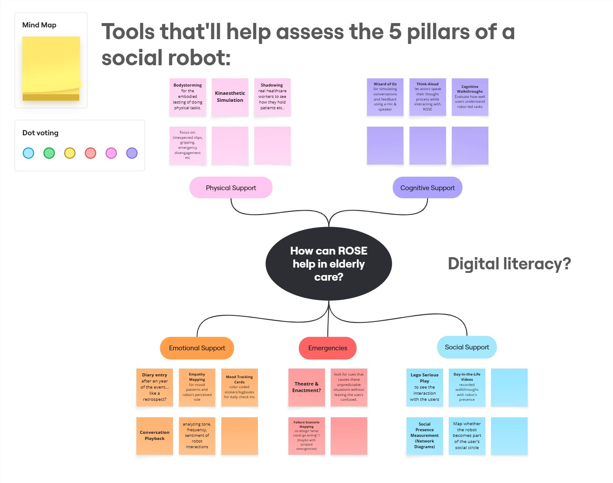
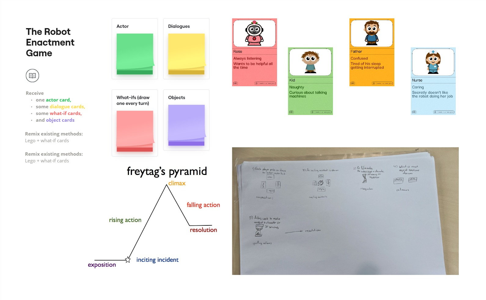
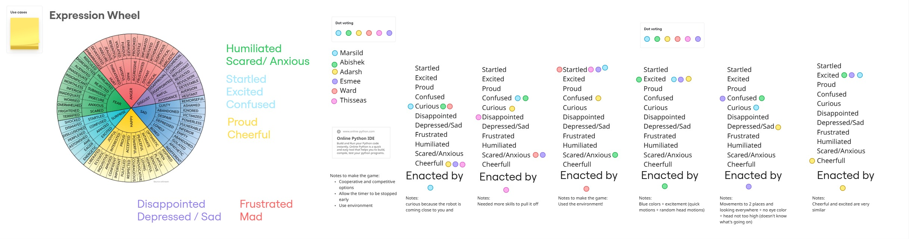

# Social Robot Design Portfolio

## Table of Contents
- [About Me](#about-me)
- Week 1 Design Tools
  - [Group Work](#group-work)
    - [Case Description](#case-description)
    - [Requirements](#requirements)
    - [Selection of Useful Design Tools](#selection-of-useful-design-tools)
    - [Slide](#slide)
  - [Reflections](#reflections)
    - [How is Design Research linked to HRI](#how-is-design-research-linked-to-hri)
    - [Digital (AI) vs Embodiment](#digital-ai-vs-embodiment)
    - [Why is HER not a compelling argument](#why-is-her-not-a-compelling-argument)
    - [The Robot Revolution: When?](#the-robot-revolution-when)
    - [Reflection: The Dinosaur Hotel](#reflection-the-dinosaur-hotel)
    - [Reflection: Nabaztag](#reflection-nabaztag)
    - [Reflection: CuddleBits](#reflection-cuddlebits)
    - [Reflection: Be-Right-Back](#reflection-be-right-back)
- Week 2 Storytelling
  - [Group Work](#group-work)
  - [Reflections](#reflections)
    - [Robot and AI Story Categories](#robot-and-ai-story-categories)
    - [Science Fiction Prototyping vs Scenario-Based Design](#science-fiction-prototyping-vs-scenario-based-design)
    - [Reflection: 21st Century Robot](#reflection-21st-century-robot)
    - [Reflection: Product Stories vs Reality](#reflection-product-stories-vs-reality)
    - [Why Storytelling Matters in Social Robot Design](#why-storytelling-matters-in-social-robot-design)
    - [Reflection: Healthcare vs Social Robot Stories](#reflection-healthcare-vs-social-robot-stories)
      
- Week 3 Expression
  - [Group Work](#group-work)

  - [Reflections](#reflections)
    - [Lessons from Ju and Hoffmann](#lessons-from-ju-and-hoffmann)
    - [Laban Framework and Alternatives](#laban-framework-and-alternatives)
    - [Designing Robot Movement](#designing-robot-movement)
    - [Sound Design, Haptics and Morphology](#sound-design-haptics-and-morphology)
    - [Anti-Social Robot Design](#anti-social-robot-design)

  - Week 4 Embodiment
  - [Group Work](#group-work)
  - [Reflections](#reflections)
    - [Embodied vs Virtual Interaction](#embodied-vs-virtual-interaction)
    - [Designing Robot Interaction](#designing-robot-interaction)
    - [Anthropomorphism vs Function](#anthropomorphism-vs-function)
    - [Function Defines Form](#function-defines-form)
---

## About Me

| Member     | Brief Introduction                                                                                                  | Personal Page |
|------------|---------------------------------------------------------------------------------------------------------------------|---------------|
| Abishek Samraj Johnson Sembudurai  | MSc student in Robotics, specilisation in Mechatronics and Physical AI, exploring robot control, perception, and HRI design.                                       | [Download My CV](CV.pdf) |

---
## Week 1 Design Tools

## Group Work

### Case Description
After poperly analising the features of ROSE robot (a social robot designed to support healthcare settings), we have categorised them as [View Features Image](Features.jpg) Then our group explored three application ideas for ROSE [View Application Image](Applications.jpg), particularly for elderly care and hospitals. The goal was to create meaningful value through companionship, cognitive stimulation, emotional connection, and assistance in daily tasks.

**Idea 1: Entertainment Robot for Children in Waiting Rooms**  
ROSE serves as a playful companion to entertain children while their guardians attend medical appointments. It adapts games based on the number and age of participants and uses cartoon-like voices and animations to remain engaging.

**Idea 2: Retro Companion for Dementia Care**  
ROSE acts as a retro-styled companion for elderly patients with Alzheimer’s or dementia. It interacts in a 60s/70s tone, plays familiar music for memory recall, and provides basic expressions. In case of emergency, it can alert trusted contacts.

**Idea 3: Autonomous Delivery Robot in Healthcare**  
ROSE functions as an autonomous logistics assistant, capable of safely transporting items such as medication or samples between different locations. It requires safe storage, navigation tools, gripping mechanisms, and monitoring for safe handling.

## Requirements  

**Idea 1 (Children’s Robot)**  
- Visually engaging and suitable for children  
- Uses entertaining dialogues and cartoon-style speech  
- Games can be adjusted based on age and group size  

**Idea 2 (Dementia Care)**  
- Calming voice using retro speech style  
- Basic facial expressions for emotional comfort  
- Familiar regional personality tone  
- Emergency alert capability  

**Idea 3 (Logistics Robot)**  
- Safe handling of items  
- Storage and gripping capabilities  
- Ability to deliver without human help

Here os the slide with 

### Selection of Useful Design Tools
- **Cognitive Walkthrough** – for usability and interaction flow
- **Wizard of Oz** – to simulate interaction before full development
- **Bull’s-eye Diagramming / MoSCoW** – to prioritize key functions
- **Stakeholder Mapping** – to identify roles and needs of all users

### Slide
- Please find the slide with summary of our case here [View Slide](Slide.jpg)
---

## Reflections

### How is Design Research linked to HRI
Chapter 8 explains that we should design robots together with users, not just by ourselves. It says to build simple versions early then test them with people, and learn from real life. It also highlights that social robot design should be user-centered, iterative, and open-source, with real-world feedback shaping the development. 

### Digital (AI) vs Embodiment

In Chapter 9 itis clear that physical bodies are optional. Users form emotional bonds through behavior, communication, and emotional intelligence rather than mechanical embodiment.
  
### Why is HER not a compelling argument
After watching the trailer of Her movie, I understand that  emotional connection is possible without a body, confirming that behavioral and emotional presence is more important than physical form.

### The Robot Revolution: When?
-  From the given textbook, Vincent predicted that we would bond with smart devices and Bar-Cohen thought we would live with humanoid robots. In real life, Vincent predictions are currently in action as we got smart phones and voice assistants. But in near future the world is advancing to live with humanoid robots.

### Reflection: The Dinosaur Hotel
The robot hotel tried to replace all staff with robots, but they often failed when guests needed help. CitizenM used robots smartly and kept people around for real support.

### Reflection: Nabaztag
Nabaztag was a cute robot that could move and talk a little. But it lacked deep emotional interaction and adaptability, so users lost interest quickly.

### Reflection: CuddleBits
CuddleBits taught that small movements like soft shaking triggered strong emotional responses and can make people feel connected. Simple, kind behavior matters more than looking fancy and complex design.

### Reflection: Be-Right-Back
I haven't watched 'Be Right Back' (Black Mirror) but after reading about it, its evident that robots can help people but cannot fully replace real humans.

...
## Week 2 Storytelling
## Group Work 

## Reflections

### Robot and AI Story Categories
Robot stories usually fall into a few types. Some show robots as friendly helpers (like in Wall-E), while others show them as dangerous or taking over (like Terminator). Some robots have emotions and form relationships (Her), while others are just tools or machines. There are also stories that make us think about the future and how robots may change our lives.

### Science Fiction Prototyping vs Scenario-Based Design
Science Fiction Prototyping is about creating stories based on real science to imagine future problems or changes. It focuses on what might happen and how it could affect people. Regular Scenario-Based Design is more practical. It helps designers think about how people would use a product in real life today. So, one is more about exploring ideas, and the other is about making real things work.

### Reflection: 21st Century Robot
The project wanted the robot to be friendly and easy to accept, so it became something like NAO—small, cute, and simple. But it could have been more unique. For example, the robot could have had different styles, learned from users over time, or had a different personality for different cultures. The story could have made it more interesting.

### Reflection: Product Stories vs Reality
Companies often tell exciting stories—like the robot being smart, friendly, and very helpful. But in real life, these robots can only do a few things. They are often not as good as shown in ads. The stories are made to sell the robot, not to show what it really does.

### Why Storytelling Matters in Social Robot Design
A good story helps people understand the robot and trust it. If the robot looks friendly but acts cold, people get confused. The story also helps designers explain their idea to others. So, the story needs to match how the robot looks, sounds, and behaves.

### Reflection: Healthcare vs Social Robot Stories
In healthcare, people want proof that something works before they use it. But robot designers often start with a cool idea or dream and test it later. This makes it hard for robots to be used in hospitals. Robot stories should include some real proof if they want to be taken seriously in healthcare.

#Week 3 Expression
## Group Work

## Week 3 Expression

### Reflections

#### **Lessons from Ju and Hoffmann**
Ju & Hoffmann's work on robot motion highlights that motion conveys meaning and can be used for expressing emotions and intentions. Applying this to my design, I can use motion to express emotional states, not just complete tasks. For instance, a robot approaching slowly could signal friendliness or caution, while quick movements may convey urgency.

#### **Laban Framework and Alternatives**
The Laban Framework is useful for describing robot motion as it relates to weight, speed, and flow. It is widely applied in HRI to design expressive robot movements. However, alternative methods such as Goffman’s Interaction Ritual Theory and the Feldenkrais Method offer different views on how motion conveys meaning. These alternatives are useful in diversifying the robot’s interaction beyond the Laban framework.

#### **Designing Robot Movement**
To design intentional movement without copying human actions, I would focus on **animacy** and **agency**. Using symbolic motion (such as stopping or tilting the head) can convey intentions without being overly anthropomorphic. For instance, a robot could communicate attention by pausing or moving in a deliberate arc rather than imitating human gestures like waving.

#### **Sound Design, Haptics and Morphology**
The Laban Framework can also inspire sound and haptic design. For example, a robot’s movement could be paired with specific sounds—quick sounds for fast motion and deep tones for slow movements. Similarly, haptic feedback like gentle vibrations can convey warmth or attention, reinforcing the robot's intention without relying on facial expressions or gestures alone.

#### **Anti-Social Robot Design**
If designing a deliberately anti-social robot, I would focus on minimal interaction, no emotional expression, and slow, stiff movement. The robot would avoid non-verbal cues like eye contact or expressive gestures, using only the most basic motions needed for functionality. This would create a robot that is functional but distant, avoiding unnecessary social engagement or emotional expression.

## Week 4 Embodiment

### Reflections

#### **Embodied vs Virtual Interaction**
- Commercial robots like **Moxie** show that physical embodiment plays a key role in how robots communicate and connect. In **Moxie’s** case, physical interaction like head movement or proximity—makes it more engaging and human-like, whereas a virtual embodiment would lack the immediacy and real-time engagement possible with physical interaction.

#### **Designing Robot Interaction**
- The paper emphasizes **embodied interaction** using human body-oriented modalities for communication. Designing robots should consider how physical presence impacts user interactions. This is crucial when deciding whether the robot should be physical (with human-like motions and gestures) or virtual (like avatars or voice-only).

#### **Anthropomorphism vs Function**
- Designing robots with **human-like traits** can be beneficial for making them approachable, but function must drive form. For example, a robot vacuum doesn’t need to resemble a human to be effective, but a companion robot might need human-like expressions to foster emotional connection. **Anthropomorphism** should not be overdone, especially if it leads to mismatched user expectations.

#### **Function Defines Form**
- The embodiment of a robot should be primarily determined by its functions. For example, a robot that must move and manipulate objects will need a design with appropriate mobility and grasping capabilities. Function-first design ensures that robots are built for practical use, with social or emotional aspects added thoughtfully for engagement.

---
