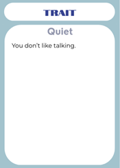
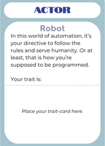
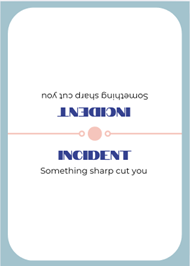
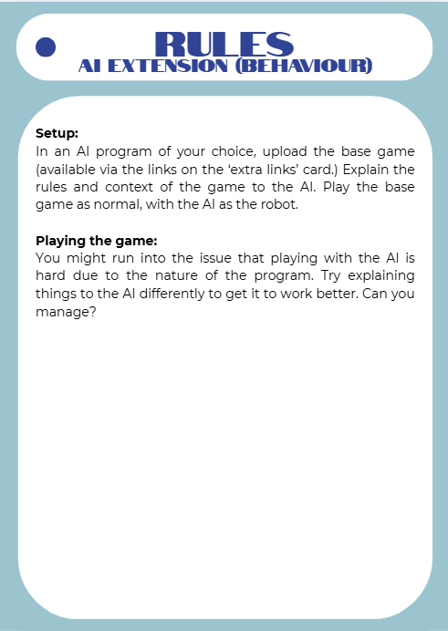
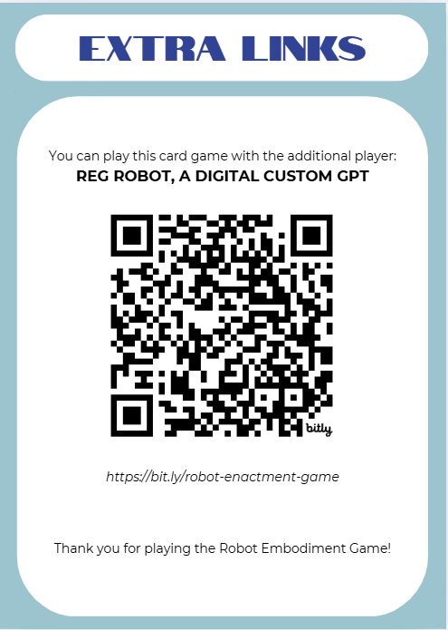

# Social Robot Design Portfolio - Group 1 
# The Robot Enactment Game
## Table of Contents
- [About Me](#about-me)

- [Design Tools](#design-tools)
  - [Group Work](#group-work)
    - [Case Description](#case-description)
    - [Requirements](#requirements)
    - [Selection of Useful Design Tools](#selection-of-useful-design-tools)
    - [Slide](#slide)
  - [Reflections](#reflections)
    - [How is Design Research linked to HRI](#how-is-design-research-linked-to-hri)
    - [Digital (AI) vs Embodiment](#digital-ai-vs-embodiment)
    - [Why is HER not a compelling argument](#why-is-her-not-a-compelling-argument)
    - [The Robot Revolution: When?](#the-robot-revolution-when)
    - [Reflection: The Dinosaur Hotel](#reflection-the-dinosaur-hotel)
    - [Reflection: Nabaztag](#reflection-nabaztag)
    - [Reflection: CuddleBits](#reflection-cuddlebits)
    - [Reflection: Be-Right-Back](#reflection-be-right-back)

- [Storytelling](#storytelling)
  - [Group Work: The Robot Enactment Game](#story-building-tool-the-robot-enactment-game)
  - [Key Insights](#key-insights)
  - [Application to ROSE Robot](#application-to-rose-robot)
  - [Reflections](#reflections)

- [Expression](#expression)
  - [Group Work: Experiment and Design Tool](#group-work-experiment-and-design-tool)
  - [Experiment: Paper Robot Embodiment](#experiment-paper-robot-embodiment)
  - [Design Tool: The Expression Game](#design-tool-the-expression-game)
  - [Experience with the Dash Robot](#experience-with-the-dash-robot)
  - [Key Insights](#key-insights)
  - [Reflections](#reflections)

- [Embodiment](#embodiment)
  - [Group Work](#group-work)
  - [Design Tool: The Embodiment Game](#design-tool-the-embodiment-game)
  - [Tools in Action – ROSE: Embodiment](#tools-in-action--rose-embodiment)
  - [Key Insights](#key-insights)
  - [Reflections](#reflections)

- [Behavior](#behavior)
  - [Group Work](#group-work)
  - [Design Tool: AI Extension – Behaviour](#design-tool-ai-extension--behaviour)
  - [Key Insights](#key-insights)

- [Ethics](#ethics)
  - [Oh but wait… – Ethical Card-Prompt Extension](#oh-but-wait--ethical-card-prompt-extension)
  - [How It Works](#how-it-works)
  - [Learnings](#learnings)
  - [Key Insight](#key-insight)
 
---

## About Me

| Member     | Brief Introduction                                                                                                  | Personal Page |
|------------|---------------------------------------------------------------------------------------------------------------------|---------------|
| Abishek Samraj Johnson Sembudurai  | MSc student in Robotics, specilisation in Mechatronics and Physical AI, exploring robot control, perception, and HRI design.                                       | [Download My CV](CV.pdf) |

---
## Design Tools

## Group Work

### Case Description
After poperly analising the features of ROSE robot (a social robot designed to support healthcare settings), we have categorised them as [View Features Image](Features.jpg) Then our group explored three application ideas for ROSE [View Application Image](Applications.jpg), particularly for elderly care and hospitals. The goal was to create meaningful value through companionship, cognitive stimulation, emotional connection, and assistance in daily tasks.

**Idea 1: Entertainment Robot for Children in Waiting Rooms**  
ROSE serves as a playful companion to entertain children while their guardians attend medical appointments. It adapts games based on the number and age of participants and uses cartoon-like voices and animations to remain engaging.

**Idea 2: Retro Companion for Dementia Care**  
ROSE acts as a retro-styled companion for elderly patients with Alzheimer’s or dementia. It interacts in a 60s/70s tone, plays familiar music for memory recall, and provides basic expressions. In case of emergency, it can alert trusted contacts.

**Idea 3: Autonomous Delivery Robot in Healthcare**  
ROSE functions as an autonomous logistics assistant, capable of safely transporting items such as medication or samples between different locations. It requires safe storage, navigation tools, gripping mechanisms, and monitoring for safe handling.

## Requirements  

**Idea 1 (Children’s Robot)**  
- Visually engaging and suitable for children  
- Uses entertaining dialogues and cartoon-style speech  
- Games can be adjusted based on age and group size  

**Idea 2 (Dementia Care)**  
- Calming voice using retro speech style  
- Basic facial expressions for emotional comfort  
- Familiar regional personality tone  
- Emergency alert capability  

**Idea 3 (Logistics Robot)**  
- Safe handling of items  
- Storage and gripping capabilities  
- Ability to deliver without human help

Here os the slide with 

### Selection of Useful Design Tools
- **Cognitive Walkthrough** – for usability and interaction flow
- **Wizard of Oz** – to simulate interaction before full development
- **Bull’s-eye Diagramming / MoSCoW** – to prioritize key functions
- **Stakeholder Mapping** – to identify roles and needs of all users

### Slide
- Please find the slide with summary of our case here [View Slide](Slide.jpg)

---

## Reflections

### How is Design Research linked to HRI
Chapter 8 explains that we should design robots together with users, not just by ourselves. It says to build simple versions early then test them with people, and learn from real life. It also highlights that social robot design should be user-centered, iterative, and open-source, with real-world feedback shaping the development. 

### Digital (AI) vs Embodiment

In Chapter 9 itis clear that physical bodies are optional. Users form emotional bonds through behavior, communication, and emotional intelligence rather than mechanical embodiment.
  
### Why is HER not a compelling argument
After watching the trailer of Her movie, I understand that  emotional connection is possible without a body, confirming that behavioral and emotional presence is more important than physical form.

### The Robot Revolution: When?
-  From the given textbook, Vincent predicted that we would bond with smart devices and Bar-Cohen thought we would live with humanoid robots. In real life, Vincent predictions are currently in action as we got smart phones and voice assistants. But in near future the world is advancing to live with humanoid robots.

### Reflection: The Dinosaur Hotel
The robot hotel tried to replace all staff with robots, but they often failed when guests needed help. CitizenM used robots smartly and kept people around for real support.

### Reflection: Nabaztag
Nabaztag was a cute robot that could move and talk a little. But it lacked deep emotional interaction and adaptability, so users lost interest quickly.

### Reflection: CuddleBits
CuddleBits taught that small movements like soft shaking triggered strong emotional responses and can make people feel connected. Simple, kind behavior matters more than looking fancy and complex design.

### Reflection: Be-Right-Back
I haven't watched 'Be Right Back' (Black Mirror) but after reading about it, its evident that robots can help people but cannot fully replace real humans.

...
## Storytelling
## Group Work 
### Story-Building Tool: *The Robot Enactment Game*

Our **story-building tool** is a **scenario-based card game** that supports storytelling in human-robot interaction. It’s designed around **Freytag’s Pyramid** and helps simulate emotionally rich social robot scenarios through role-playing and improvisation.

---

### Freytag’s Pyramid: A Narrative Framework for HRI

Freytag’s Pyramid provides a five-part story structure ideal for emotional and decision-driven robot narratives. In our enactment game, it helps scaffold scene dynamics and robot-user interactions across the full emotional arc.

> 

- **Exposition**: Introduce robot & human roles  
- **Inciting Incident**: Trigger an emotional or logistical challenge  
- **Rising Action**: Players build tension through roleplay  
- **Climax**: The robot must act meaningfully  
- **Falling Action & Resolution**: Players reflect and resolve the scenario  

This format brings structure to roleplay, enabling speculative and realistic testing of robot behavior, empathy, and collaboration.

> 📚 *Reference:*  
Abd Aziz, S. H., Ahmad Ridzuan, A. N. A., Khamis, M. H., Mohd Azni, Z., Hassan, M. S., & Abdul Rani, N. S. (2024).  
*The Integration of Freytag’s Pyramid into AI-Generated Art Prompts*.  
International Journal of Academic Research in Business and Social Sciences, 14(6).  
[https://doi.org/10.6007/ijarbss/v14-i6/20143](https://doi.org/10.6007/ijarbss/v14-i6/20143)

---

#### How the Game Works

**Setup:**
- One player is chosen as the **robot**.
- Other players receive an **Actor Card**.
- All players get a **Trait Card**.

> *Example Cards Below*  
>   
> 

---

**The Incident:**
- A player draws an **Incident Card** and reads it aloud.
- Set a 1-minute timer.
- All participants act out their roles and react to the scenario.

> *Example Incident Card:*  
> 

---

**The Resolution:**
- Each player draws:  
  - 2 **Object Cards**,  
  - 2 **Action Cards**,  
  - and 1 **Wild Card**.
- Set the timer again.
- Players resolve the scenario **in character**, using one or more of their cards.
- Wild Cards can represent any custom solution imagined by the player.

> *Summary of Rules:*  
> 

---

**Next Round:**
- The robot role rotates to the next player.
- Wild Cards are kept.
- Other cards are shuffled.
- New round begins with the Setup.

Full card set and template:  
[ Canva Design Link](https://www.canva.com/design/DAGmrcvpGLM/Vz-GDnWxM2QvK-Gzf1fmzg/view?utm_content=DAGmrcvpGLM&utm_campaign=designshare&utm_medium=link2&utm_source=uniquelinks&utlId=h62cb1e60a3)

---

##  Key Insights 

####  1. Scenario-Based Roleplay Enables Meaningful HRI Prototyping

The **Robot Enactment Game** transforms abstract robot functions into **situated, social behaviors** through structured roleplay. By assigning roles and traits to human players and introducing the robot as a participant, we were able to simulate real-world emotional dynamics (e.g., urgency, empathy, conflict).

**Insight:**  
Role-based storytelling provides a low-fidelity yet high-impact way to explore how a robot should behave in uncertain, emotional, or multi-user situations.

📚 *Reference:*  
Doernbach, T., & Gerndt, R. (2025). *Scenario-Based Learning in Human-Robot Interaction: Embedding User-Centered Design Into Computer Science Education*. In Palinko, O. et al. (Eds.), Social Robotics. Lecture Notes in Computer Science, vol 15561. Springer.  
[https://doi.org/10.1007/978-981-96-3522-1_14](https://doi.org/10.1007/978-981-96-3522-1_14)

---

#### 2. Freytag’s Pyramid Creates Narrative Structure in Robot Interaction

Using **Freytag’s Pyramid** helped us scaffold emotional escalation and robot decision points in a natural way. This made robot behaviors more coherent and helped us script and test how robots handle peak moments like distress, accidents, or social friction.

**Insight:**  
Mapping robot responses to dramatic structure ensures timing, reactivity, and emotional tone are coherent and contextually meaningful.

📚 *Reference:*  
Abd Aziz, S. H. et al. (2024). *The Integration of Freytag’s Pyramid into AI-Generated Art Prompts*. International Journal of Academic Research in Business and Social Sciences, 14(6).  
[https://doi.org/10.6007/ijarbss/v14-i6/20143](https://doi.org/10.6007/ijarbss/v14-i6/20143)

---

#### 3. Card-Based Modularity Encourages Replayability and Rich Variation

Our modular card system (Actor, Trait, Incident, Object, Action, Wild) supports both **realistic and speculative testing**. Players can easily generate new situations while preserving narrative structure.

**Insight:**  
Modular storytelling tools support rapid iteration and scenario diversity—crucial for uncovering edge cases and unintended consequences in HRI design.

---

### Application to ROSE Robot

We adapted the game for healthcare design with ROSE robot. Two example scenarios used:

1. **Sleepless Night Scenario**  
   A child’s mother cannot sleep and screams at night—possibly due to a health crisis involving her grandmother.

2. **Bathroom Scenario**  
   An elderly man needs to use the bathroom but can’t get up from bed alone.

These scenarios helped test how a robot like ROSE could mediate distress, prioritize emergencies, or act empathetically.

---

## Reflections

### Robot and AI Story Categories
Robot stories usually fall into a few types. Some show robots as friendly helpers (like in Wall-E), while others show them as dangerous or taking over (like Terminator). Some robots have emotions and form relationships (Her), while others are just tools or machines. There are also stories that make us think about the future and how robots may change our lives.

### Science Fiction Prototyping vs Scenario-Based Design
Science Fiction Prototyping is about creating stories based on real science to imagine future problems or changes. It focuses on what might happen and how it could affect people. Regular Scenario-Based Design is more practical. It helps designers think about how people would use a product in real life today. So, one is more about exploring ideas, and the other is about making real things work.

### Reflection: 21st Century Robot
The project wanted the robot to be friendly and easy to accept, so it became something like NAO—small, cute, and simple. But it could have been more unique. For example, the robot could have had different styles, learned from users over time, or had a different personality for different cultures. The story could have made it more interesting.

### Reflection: Product Stories vs Reality
Companies often tell exciting stories—like the robot being smart, friendly, and very helpful. But in real life, these robots can only do a few things. They are often not as good as shown in ads. The stories are made to sell the robot, not to show what it really does.

### Why Storytelling Matters in Social Robot Design
A good story helps people understand the robot and trust it. If the robot looks friendly but acts cold, people get confused. The story also helps designers explain their idea to others. So, the story needs to match how the robot looks, sounds, and behaves.

### Reflection: Healthcare vs Social Robot Stories
In healthcare, people want proof that something works before they use it. But robot designers often start with a cool idea or dream and test it later. This makes it hard for robots to be used in hospitals. Robot stories should include some real proof if they want to be taken seriously in healthcare.

## Expression
## Group Work: Experiment and Design Tool

In our group work for **Session 3: Expression**, we explored a tool for **expressive behavior design** in social robots using both physical and digital methods. The **paper robot** experiment was aimed at simulating and puppeteering nonverbal expressions such as happiness, sadness, and listening. This helped us understand how robots can convey emotions through physical embodiment without relying on facial expressions.

#### Experiment: Paper Robot Embodiment

We started with a simple paper-based robot embodiment. The robot was created by folding a paper cube with a polystyrene ball (head) attached to it by a spring.

  
*Neutral state: Robot is calm and attentive.*

**Emotions simulated:**
1. **Neutral:** The robot maintains a stable position, neither showing extreme emotion nor reaction.
2. **Happy:** The robot's head wiggles as if expressing excitement.
3. **Sad:** The head bows down to signify sadness.
4. **Listening:** The robot's head tilts upwards toward the speaker to show attention.

**Videos of these states:**
- [Neutral State](https://photos.app.goo.gl/y7njuL2U7Rp3F9j18)
- [Happy State](https://photos.app.goo.gl/2fbrpPvGrXz1HEPD7)
- [Listening State](https://photos.app.goo.gl/BhKkMQpAKL8Hex1S6)
- [Sad State](https://photos.app.goo.gl/yo1JCWAfzobr66iE8)

#### Observations from the Experiment

After experimenting with the paper robot, we discussed the following insights:
- The **Sad state** was universally understood through the downward bow of the head.
- The **Happy state** was interpreted as excitement by some, though others felt it conveyed joy.
- The **Listening state** required clarification, as some thought the robot was asking “yes/no” rather than showing attention by tilting its head.
- This exercise helped us realize how **nonverbal communication** can express a range of emotions, even with minimal design.

---

#### **Design Tool: The Expression Game**

The **Expression Game** is designed to explore how robots can express emotions through movement, gestures, and sounds. This game allows participants to simulate a variety of robot behaviors and responses, using a set of predefined emotions. It tests the ability of a robot to convey its emotional state and how others interpret that expression. The tool aims to enhance the design of robots that can express emotions in a meaningful way.

---

#### **Rules of the Game:**

**Setup:**
- One player is chosen to be the **Robot Controller**.
- The other players are the **Guessers**.
- The **Robot Controller** draws an **Emotion Card** from a predefined list. The emotion must remain secret throughout the round.
- Players take turns being the **Robot Controller**.

**The Expression Round:**
- The **Robot Controller** has **30 seconds** to express the emotion using the available robot features (e.g., motion, lights, gestures, sounds). The robot can move and interact with the environment during this round to express the emotion.

**The Guessing:**
- After the **Expression Round**, all players (**Guessers**) cast a vote on which emotion they think the robot has expressed. Voting is done by raising hands or using other simple methods.

**The Reveal & Discussion:**
- The **Robot Controller** reveals the actual emotion.
- A short **group discussion** follows, where participants reflect on:
  - **What cues led to the guesses?**
  - **What made the expression clear or confusing?**
  - **How could the robot’s expressiveness be improved?**

**Next Round:**
- The next player clockwise becomes the new **Robot Controller**.
- A new **Emotion Card** is drawn, and the game repeats.

---
> *Summary of Rules:*  
> 
---
#### **Experience with the Dash Robot**

In our group, we used the **Dash Robot** for this activity. Dash is a small, programmable educational robot with three degrees of freedom: two wheels for movement and a head that can pan and tilt. It also features LEDs and speakers to produce various emotional cues like lights and sounds.

**Steps we followed:**
1. **Familiarization with the Dash Robot**:  
   Participants first familiarized themselves with the robot's controls via a smartphone app. The robot’s capabilities, including movement, sound, and LED control, were explored.

   

3. **Emotion Selection**:  
   The **Robot Controller** selected an emotion from the predefined list (e.g., Happy, Sad, Angry, Confused). The emotion was kept secret from the other players.

4. **Expression Performance**:  
   The **Robot Controller** used the Dash Robot’s features to express the chosen emotion. This was done through:
   - **Movement**: The robot might move in a particular way to convey the emotion (e.g., slow, deliberate movements for sadness or rapid movement for excitement).
   - **Sound**: The robot might play specific sounds that align with the emotion (e.g., upbeat music for happiness or a low-pitched sound for sadness).
   - **Lights**: Dash's LED lights were used to reinforce the emotional state (e.g., red for anger, green for calmness).

5. **Guessing**:  
   After the robot’s expression, the other participants guessed the emotion based on the robot’s movements, sounds, and lights.

6. **Reveal & Discussion**:  
   The **Robot Controller** revealed the actual emotion, and the group discussed:
   - **What clues led them to their guess?**
   - **Was the robot's expression clear or ambiguous?**
   - **How could the robot's expressiveness be improved for better understanding?**

---

#### Videos
  - [Round 1 - Confused](https://photos.app.goo.gl/mKKXT75fJZSimFBq9)
  - [Round 2 - Excited](https://photos.app.goo.gl/5Td6v3C9Th9fM2ZSA)

---

---
## Key Insights

#### 1. Nonverbal Expression Is a Core Communication Modality in HRI

In our paper robot experiment, we explored how posture-based cues like head tilting and bowing express emotions such as “sad,” “curious,” or “listening.” While some expressions (like sadness) were universally understood, others (like excitement) were interpreted inconsistently.

**Insight:**  
Nonverbal expression is powerful but easily misinterpreted. Effective HRI design requires intentional gestures, timing, and posture clarity.

📚 *Reference:*  
Urakami, J., & Seaborn, K. (2023). *Nonverbal Cues in Human–Robot Interaction: A Communication Studies Perspective*.  
ACM Trans. Hum.-Robot Interact., 12(2), Article 22.  
[https://doi.org/10.1145/3581972](https://doi.org/10.1145/3581972)

---

#### 2. Multimodal Cues Improve Clarity and Emotion Perception

Participants often struggled to interpret **single-modal gestures** (like a head wiggle) in the absence of light or sound. We found that expressive accuracy improves when motion is paired with auditory or visual reinforcement.

**Insight:**  
Gesture alone is not enough—robots need multimodal communication (e.g., lights, sounds) to express emotion with higher fidelity.

📚 *Reference:*  
Johnson, D.O., Cuijpers, R.H., & van der Pol, D. (2013). *Imitating Human Emotions with Artificial Facial Expressions*.  
International Journal of Social Robotics, 5, 503–513.  
[https://doi.org/10.1007/s12369-013-0206-0](https://doi.org/10.1007/s12369-013-0206-0)

---

#### 3. Semantic-Free Sound Adds Emotional Reinforcement

We observed that expressions such as “excited” or “curious” were difficult to distinguish when only visual motion was used. Adding even simple, **nonverbal sound cues** (like hums, beeps, or pulses) could help make robot emotions more distinguishable.

**Insight:**  
Semantic-free utterances are an underused channel for reinforcing robot intent and emotion, especially in ambiguous contexts.

📚 *Reference:*  
Yilmazyildiz, S., Read, R., Belpaeme, T., & Verhelst, W. (2016). *Review of Semantic-Free Utterances in Social Human–Robot Interaction*.  
International Journal of Human–Computer Interaction, 32(1), 63–85.  
[https://doi.org/10.1080/10447318.2015.1093856](https://doi.org/10.1080/10447318.2015.1093856)

---

### Reflections

#### **Lessons from Ju and Hoffmann**
Ju & Hoffmann's work on robot motion highlights that motion conveys meaning and can be used for expressing emotions and intentions. Applying this to my design, I can use motion to express emotional states, not just complete tasks. For instance, a robot approaching slowly could signal friendliness or caution, while quick movements may convey urgency.

#### **Laban Framework and Alternatives**
The Laban Framework is useful for describing robot motion as it relates to weight, speed, and flow. It is widely applied in HRI to design expressive robot movements. However, alternative methods such as Goffman’s Interaction Ritual Theory and the Feldenkrais Method offer different views on how motion conveys meaning. These alternatives are useful in diversifying the robot’s interaction beyond the Laban framework.

#### **Designing Robot Movement**
To design intentional movement without copying human actions, I would focus on **animacy** and **agency**. Using symbolic motion (such as stopping or tilting the head) can convey intentions without being overly anthropomorphic. For instance, a robot could communicate attention by pausing or moving in a deliberate arc rather than imitating human gestures like waving.

#### **Sound Design, Haptics and Morphology**
The Laban Framework can also inspire sound and haptic design. For example, a robot’s movement could be paired with specific sounds—quick sounds for fast motion and deep tones for slow movements. Similarly, haptic feedback like gentle vibrations can convey warmth or attention, reinforcing the robot's intention without relying on facial expressions or gestures alone.

#### **Anti-Social Robot Design**
If designing a deliberately anti-social robot, I would focus on minimal interaction, no emotional expression, and slow, stiff movement. The robot would avoid non-verbal cues like eye contact or expressive gestures, using only the most basic motions needed for functionality. This would create a robot that is functional but distant, avoiding unnecessary social engagement or emotional expression.

## Embodiment
## Group Work

In this session, we explored embodiment as a critical element in social robot design—how a robot’s form, posture, color, and attachments shape user expectations and interpretations. Our group created a new design tool inspired by **Gartic Phone**, modified to focus on **scenario-based embodiment design**. The tool builds upon our Session 2 Story-Building Game, using the same scenario cards to prompt creative robot designs.

---

## Design Tool: The Embodiment Game

The **Embodiment Game** is a fast-paced, drawing-based activity aimed at generating diverse robot embodiments for different social contexts. 

The tool helps participants reflect on:
- How **form defines function**
- How robot **morphology** can hint at roles or intentions
- How interpretation **shifts across iterations**

---

## Rules of the Game

> 

---

### Setup

- Each participant gets an **empty drawing card** (paper or tablet).
- One participant secretly draws a **scenario prompt** from the Story Building Card Deck.
- The scenario is **not shared** with the group.

---

###  Round 1: Drawing the Robot

- The first participant draws a **robot embodiment** suited to the secret scenario.
- Drawing can be manual or AI-generated (e.g., DALL·E, Midjourney).
- Emphasize design features such as:
  - Tools, posture, size, shape
  - Color, expressions, attachments
- Time limit: 2 minutes

---

### Round 2: Guess the Scenario

- The drawing is passed clockwise to the next player.
- This participant **guesses the original scenario** based solely on the drawing.
-  No clarifications or explanations are allowed.

---

###  Round 3: New Robot Design

- The guessed scenario is passed again to another participant.
- That player draws a **new robot embodiment** based on the guessed scenario.
- Time limit: 2 minutes
- This round **tests how ideas mutate** through visual interpretation.

---

### Discussion

Once all rounds are completed, all drawings and guesses are placed in order. Then, each player reflects on:

- **What they drew or guessed**
- **Why they made specific design choices** (e.g., tools, lights, shape)
- **What helped or confused** the interpretation

---
## Tools in Action – ROSE: Embodiment

To put our **Embodiment Game** into practice, we tested it using real sketches of the **ROSE robot** in healthcare scenarios. Each participant began by drawing their interpretation of ROSE based on a scenario prompt. The drawing was passed to another player who guessed the scenario and redrew the robot based on their interpretation. A third player continued the cycle by drawing again based on the second guess.

The results were revealing—and sometimes hilarious. A single design detail could completely change the robot’s intended purpose. This helped us surface how **form directly shapes perception**.

> 

---

### Game Flow & Sketch Interpretation

| **Participant** | **Drawing or Guess** | **Explanation** |
|----------------|----------------------|-----------------|
| **Adarsh**     |    ROSE with a cleaning rag in the base | Based on scenario: wet floor; Adarsh adapts the robot’s base for cleaning. |
| **Marsild**    | Guesses: “The cleaner is sick and the robot should help clean the floor” | Logical interpretation; assumes the robot is compensating for human absence. |
| **Abishek**    |    ROSE with a bucket in the stomach and mop in hand | Enhances the cleaning metaphor with anthropomorphic tools. |

---

| **Participant** | **Drawing or Guess** | **Explanation** |
|----------------|----------------------|-----------------|
| **Abishek**    |    ROSE with spikes to prevent touch | Protects itself when transporting medication; designed for safety. |
| **Adarsh**     | Guesses: “Robot should not be touched” | Interprets the spikes as a warning rather than defense. |
| **Marsild**    |    Adds a warning sign and alarm | Reinforces the anti-touch concept through visual and auditory cues. |

---

| **Participant** | **Drawing or Guess** | **Explanation** |
|----------------|----------------------|-----------------|
| **Marsild**    |    ROSE holding a urinal | Reflects bathroom assistance scenario. |
| **Abishek**    | Misinterprets: “Robot should dispense water to who needs it” | Mistook the urinal for a glass. |
| **Adarsh**     |    ROSE with a water dispenser on the front | Adjusts design based on water-dispensing function. |

---

### What This Taught Us

- **Small design elements (e.g., a bucket or spike) lead to vastly different interpretations.**
- Players brought their own assumptions and cultural lenses into the redesign.
- This game made misunderstandings visible early **before** they became embedded in physical prototypes.
- Sketching ROSE allowed us to experiment with roles like cleaner, protector, and care-assistant across multiple scenarios.

---

## Key Insights

#### 1. Embodiment Communicates Function and Emotion

During the Embodiment Game, we found that even small differences in robot sketches—like spikes vs. rounded corners or hand-held tools vs. built-in components—significantly affected player interpretation. Robots were seen as “threatening,” “medical,” or “harmless cleaner” based on simple visual cues.

**Insight:**  
Embodiment is not neutral—shape, posture, and design details influence users’ emotional reactions and perceived robot purpose.

📚 *Reference:*  
Hwang, J., Park, T., & Hwang, W. (2013). *The effects of overall robot shape on the emotions invoked in users and the perceived personalities of robot*.  
Applied Ergonomics, 44(3).  
[https://doi.org/10.1016/j.apergo.2012.10.010](https://doi.org/10.1016/j.apergo.2012.10.010)

---

#### 2. Sketch-Based Play Surfaces Interpretative Gaps

Our drawing and guessing game revealed how **design ambiguity** leads to misinterpretation. A robot holding a urinal was mistaken for a water-dispenser. A cleaning bot with a bucket in its torso evoked “hospital waste bin” instead of helper.

**Insight:**  
Embodiment games help identify mismatch between designer intention and user perception—critical for inclusive robot design.

📚 *Reference:*  
Dennler, N., Ruan, C., Hadiwijoyo, J., Chen, B., Nikolaidis, S., & Matarić, M. (2023). *Design Metaphors for Understanding User Expectations of Socially Interactive Robot Embodiments*.  
ACM Transactions on Human-Robot Interaction, Article No. 21, Issue 14.  
[https://doi.org/10.1145/3582993](https://doi.org/10.1145/3582993)

---

#### 3. Form Reflects Cultural Sensitivity and Social Norms

When prompted with a cultural constraint (e.g., hygiene visibility in certain contexts), participants redesigned the robot to hide or soften equipment presence. A “visible urinal” was replaced with a delivery-style drawer. A “spike” warning became a light or verbal cue.

**Insight:**  
Social robots must be embodied with cultural cues and metaphors in mind—especially in health and care domains.

📚 *Reference:*  
T. Hwang, J., Park, T., & Hwang, W. (2012). *The effects of overall robot shape on the emotions invoked in users and the perceived personalities of robot*.  
Elsevier Ltd and The Ergonomics Society.  
[https://doi.org/10.1016/j.apergo.2012.10.010](https://doi.org/10.1016/j.apergo.2012.10.010)

---

#### 4. Embodiment Games Foster Rapid, Speculative Prototyping

Inspired by Gartic Phone, our embodiment game let participants prototype **non-standard robot forms** for unique contexts. Through drawing and guessing, players explored how form reflects role, context, and affordance—without needing physical hardware.

**Insight:**  
Sketch-based games are a low-barrier tool to test form-function assumptions early in the design process, encouraging inclusive, speculative iteration.

---

---
### Reflections

#### **Embodied vs Virtual Interaction**
- Commercial robots like **Moxie** show that physical embodiment plays a key role in how robots communicate and connect. In **Moxie’s** case, physical interaction like head movement or proximity—makes it more engaging and human-like, whereas a virtual embodiment would lack the immediacy and real-time engagement possible with physical interaction.

#### **Designing Robot Interaction**
- The paper emphasizes **embodied interaction** using human body-oriented modalities for communication. Designing robots should consider how physical presence impacts user interactions. This is crucial when deciding whether the robot should be physical (with human-like motions and gestures) or virtual (like avatars or voice-only).

#### **Anthropomorphism vs Function**
- Designing robots with **human-like traits** can be beneficial for making them approachable, but function must drive form. For example, a robot vacuum doesn’t need to resemble a human to be effective, but a companion robot might need human-like expressions to foster emotional connection. **Anthropomorphism** should not be overdone, especially if it leads to mismatched user expectations.

#### **Function Defines Form**
- The embodiment of a robot should be primarily determined by its functions. For example, a robot that must move and manipulate objects will need a design with appropriate mobility and grasping capabilities. Function-first design ensures that robots are built for practical use, with social or emotional aspects added thoughtfully for engagement.

## Behavior 
## Group Work
In **Session 6: Behaviour**, we explored how to prototype high-level robot behaviour using natural language AIs like ChatGPT. Our goal was to play the **Robot Enactment Game** (from Week 2) with a **digital robot player** a GPT-powered AI.

This design tool helps us understand how to **structure interactions**, **assign intent**, and refine **robotic responses** in emotionally rich scenarios.

---

##  Design Tool: AI Extension – Behaviour

The **AI Extension** lets you use an **AI program** (e.g., ChatGPT or Character.ai) as the **robot player** in the Robot Enactment Game. It turns the storytelling experience into a **real-time behaviour simulation** challenge.

---

##  Rules of the Game

> 

---

###  Setup

- Choose an AI platform like ChatGPT or Poe.
- Load or link to the **Robot Enactment Game** rules and scenario cards.
- Assign the **AI as the Robot**.
- Human players draw **Actor Cards** and **Trait Cards** as usual.

🔗 To play directly with our custom GPT called **REG ROBOT**, scan the QR or use the link below:

>   
> [https://bit.ly/robot-enactment-game](https://bit.ly/robot-enactment-game)

---

### Playing the Game

- Begin the game as normal:
  - One player draws an **Incident Card** and reads it aloud.
  - Players act out their characters based on Actor and Trait Cards.
  - The **AI robot** must respond in character.

- During the **Resolution Phase**, the AI must:
  - Understand social and emotional dynamics
  - Prioritize conflicting needs
  - Make safe, empathetic decisions

---

### Challenge Mode

- You may find that the AI:
  - Gets confused about who is speaking
  - Responds too generically or passively
  - Breaks character or repeats phrases

💡 Your job is to **rephrase**, **guide**, and **prompt** the AI to perform better.

---
## Key Insights

#### 1. AI Behavior Depends Heavily on Framing and Prompt Clarity

When we used ChatGPT to act as the robot in our storytelling game, its behavior was often contextually appropriate—but only after being given **very specific framing**, role assignments, and conversational structure. If the instructions were vague, the AI gave neutral or generic responses.

**Insight:**  
Social robot behavior is shaped not just by logic, but by **how roles, tasks, and environments are framed**. Prompt engineering becomes part of behavior design.

---

#### 2. AI Struggles with Multi-User Prioritization and Timing

In scenarios with multiple human roles (e.g., child crying, cleaner mopping, nurse yelling), the AI often failed to prioritize correctly or delayed action. For example, it addressed each character equally, rather than triaging the emergency or resolving emotional distress first.

**Insight:**  
Robots operating in real-life social settings must be equipped with **priority-based, interruptible behavior flows**, not sequential rule-following logic.

---

#### 3. Turn-Based Interaction Reveals Limitations of Linear Scripts

The AI’s tendency to default to turn-based “chat” structure caused mismatches with dynamic, overlapping social interactions. Real-world social settings are not polite turn-taking systems—they involve **interruptions, parallel demands, and reactive escalation**.

**Insight:**  
Social robots need behavior models that go beyond scripted exchanges—they should support **asynchronous attention**, **real-time reactivity**, and **context switching**.

---

#### 4. Behavior Testing with AI Surfaces Design Gaps Early

Using ChatGPT in simulation mode allowed us to test and **debug behavior expectations** before implementing any real code or hardware. For example, we realized that emotion detection, multi-role arbitration, and tone consistency were not well supported by default.

**Insight:**  
Behavior prototyping through AI simulation is a **low-cost, high-yield method** to identify where robot responses will likely break down or confuse users.

---

#### 5. Adaptive Behavior Encourages Trust and Natural Interaction

Static responses quickly feel robotic or cold in long term use. Our enactment highlighted that **emotionally responsive** and **context-aware adjustments** (like softening tone or adapting to emotional escalation) made the robot feel more human-like and trustworthy.

**Insight:**  
Robots that adapt behavior to context and emotion foster **greater trust** in users over repeated interactions.

📚 *Reference:*  
Leite, I., Pereira, A., Mascarenhas, S., Martinho, C., & Paiva, A. (2013).  
*The Influence of Empathy in Human–Robot Relations.*  
International Journal of Human-Computer Studies, 71(3), 250–260.  
[https://doi.org/10.1016/j.ijhcs.2012.09.005](https://doi.org/10.1016/j.ijhcs.2012.09.005)

---
## Ethics  
## *Oh but wait…* – Ethical Card-Prompt Extension

Designing social robots for the present is often straightforward—until you hit that moment of, *“Wait… what if?”*

- What if the robot is deployed in a culture where visible hygiene tools are taboo?
- What if it's introduced in a context where caregiving roles carry different social expectations?
- What if the robot becomes outdated, but the person relying on it doesn't?

To explore these complex tensions, we introduced an **ethical card-prompt extension** to our base scenario-building game. This deck, inspired by the [Envisioning Cards toolkit](https://vsdesign.org/toolkits/envisioningcards/), is called:

### *“Oh but wait…” Cards*

>   
>   
> 

These cards bring unexpected twists—cultural, temporal, or social—that challenge initial assumptions and invite deeper ethical reflection.

---

### How It Works

1. A player begins by drawing and playing through a scenario as usual.
2. Just after the climax (or midway through), a random *“Oh but wait…”* card is drawn.
3. This card introduces a disruptive new variable (e.g., a cultural clash or future time jump).
4. Players must now reconsider or adapt their robot design in response.
5. A reflection round follows, discussing the values challenged and assumptions revealed.

---

### Example Prompts

- “Oh but wait… this robot is deployed in a country where autonomy is valued over safety.”
- “Oh but wait… hygiene items must be private in this cultural context.”
- “Oh but wait… the robot is still emotionally relied on, even though it’s obsolete.”

---

### Learnings

- Ethical and sustainability issues are best addressed **during** the design phase—not after it.
- Shifting the context mid-game revealed how deeply our designs rely on **unstated norms**.
- These prompts helped us reflect on values such as:
  - **Dignity**
  - **Autonomy**
  - **Privacy**
  - **Longevity**
- Most importantly, they reminded us to design **not just for today, but for how unpredictable the future may be**.

---

### Key Insight

**Insight:**  
Ethical considerations must be embedded into the design process—not added as an afterthought. By injecting cultural, temporal, or emotional shifts mid-play, we uncovered deep assumptions and opened space for more adaptable, inclusive design.

📚 *Reference:*  
Inspired by the [Envisioning Cards](https://vsdesign.org/toolkits/envisioningcards/) developed at the Values in Design Lab (University of Washington)

---

